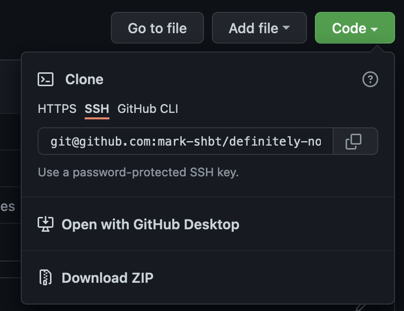

# Definitely Not Wordle

## Common commands
- Navigating
   - Mac
     - `cd Desktop/definitely-not-wordle`
   - Windows
     - `cd .\Desktop\definitely-not-wordle`
- Activating the environment
  - Mac:
    - `source env/bin/activate`
  - Windows:
    - `.\env\Scripts\activate`
- Play
  - `python not_wordle.py`
- Terminate
  - `ctrl + c` on keyboard

## Getting Started

### Prerequisite
You'll need to have Python installed on your computer first. If you're Mac, you don't need to worry about it since it comes with it. If you're on Windows, download the Windows Installer from [here](https://www.python.org/downloads/release/python-3102/)
- You can verify if you have python by entering the commands below. If it returns something like `Python 3.X.X` then you're good to go
  - `python --version` (Windows)
  - `python3 --version` (Mac)

### Actual Start
1. Download this program by clicking on `Code` and click `Download Zip`

   - After downloading, extract the zip file in any folder desire. For this walkthrough, I'll be extracting at `Desktop`
1. Open Terminal
   - Mac
     - Search for `Terminal` app in your app list
   - Windows
     - Search for `Windows PowerShell`
2. Navigating to the folder via terminal -- copy and paste the commands below into your terminal
   - Mac
     - `cd Desktop/definitely-not-wordle`
   - Windows
     - `cd .\Desktop\definitely-not-wordle`
    - Explanation: `cd` is the command that's used to navigate between folders in terminal. Each `/` (Mac) or `\` (Windows) represents a directory (aka folders). By doing `cd Desktop/definitely-not-wordle`, we're telling our terminal to navigate to the `Desktop` folder then go into `definitely-not-wordle` folder
3. Check to ensure you're in the right directory by entering `ls` into your shell (for both Windows and Mac). If you see these files below then you're in the right place. Otherwise, refer to the step above and navigate to the right directory
    ```
    .gitignore
    .not_wordle.py
    README.md
    requirements.txt
    ```
4. Creating virtual environment
     - Mac:
       - `python3 -m venv env`
     - Windows:
       - `python -m venv env`
     - Since this program has some third party libraries and packages, we're going to create a virtual environment to install the libraries. By doing this, we contain any packages we're installing into the local directory (`definitely-not-wordle`) instead of your computer. When you delete the folder, all the installed packages will get deleted as well :)
5. Activating the environment
     - Mac:
       - `source env/bin/activate`
     - Windows:
       - `.\env\Scripts\activate`
6. Installing the libraries
     - `pip install -r requirements.txt`
7. Play
     - `python not_wordle.py`
     - If you want to stop the program in the middle of it and want to restart, hit `ctrl + c` (Widnows and Mac) to terminate the program immediately. And run `python not_wordle.py` to start again